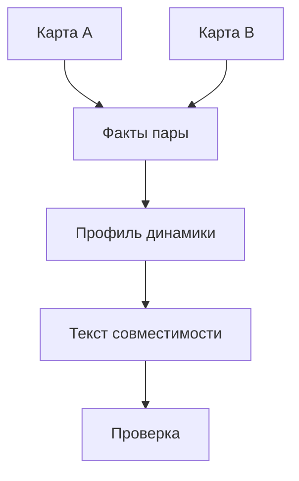

# Схема новых генераций

## 1. Общий pipeline

### Stage 0 — вход и нормализация

На входе:

- профиль пользователя;
- данные рождения;
- тип продукта;
- для совместимости — профиль второго человека.

Проверить обязательные поля, привести даты и время к единому формату, отметить
`time_is_approximate`.

### Stage 1 — расчёт карты

Астрологический модуль рассчитывает только структурированные данные:

- планеты и знаки;
- градусы и дома;
- Асцендент;
- аспекты;
- для пары — синастрические связи.

Модель не должна самостоятельно вычислять карту.

### Stage 2 — карта фактов

Из полной карты формируется компактный набор фактов для конкретного продукта.
Каждый факт получает стабильный `fact_id`, тему и источник:

```json
{
  "fact_id": "primary.sun.sign",
  "topic": "personality",
  "text": "Карта 1: Солнце в Овне, дом 1",
  "source": "primary_chart.planets.Солнце"
}
```

Отбор фактов зависит от продукта. В профиль не попадают случайные показатели
только ради заполнения объёма.

### Stage 3 — структурированный профиль

Модель или отдельный сервис создаёт JSON-профиль без красивого литературного
текста. В нём фиксируются:

- главные темы;
- сильные стороны;
- возможные сложности;
- внутренние противоречия;
- отношения;
- деньги и работа;
- точки роста;
- ссылки на `fact_id`.

Этот этап нужен, чтобы free и full версии использовали единую смысловую основу,
но раскрывали разную глубину.

### Stage 4 — генерация текста

Отдельный вызов превращает профиль в текст выбранного продукта. Он обязан:

- использовать только переданные поля профиля;
- ссылаться только на разрешённые факты;
- соблюдать структуру продукта;
- писать вероятностно, без фатализма;
- не дублировать уже раскрытые разделы.

### Stage 5 — контроль качества

Проверить JSON-схему, порядок разделов, длину, ссылки на факты, запрещённые
формулировки, повторы и отсутствие неподтверждённых утверждений.

При ошибке повторять только текущий этап с короткой диагностикой, а не весь
pipeline. После исчерпания попыток переводить генерацию в `failed`, не выдавая
непроверенный текст пользователю.

### Stage 6 — выдача

Один и тот же проверенный результат можно:

- показать сообщениями Telegram;
- собрать в PDF;
- сохранить как контекст для последующего вопроса пользователя.

## 2. Режимы продуктов

| Product | Назначение | Рекомендуемый объём | Глубина |
|---|---|---:|---|
| `PERSONALITY_FREE` | самостоятельный ознакомительный продукт | 800–1500 слов | 3–5 тем |
| `PERSONALITY_FULL` | полный профиль личности | 3500–6000 слов | все темы |
| `LOVE_FULL` | отдельный любовный профиль | 2500–4500 слов | отношения |
| `MONEY_FULL` | деньги и реализация | 2500–4500 слов | работа и ресурсы |
| `COMPATIBILITY_FREE` | короткий просмотр динамики пары | 500–900 слов | 3 слоя |
| `COMPATIBILITY_FULL` | полный анализ пары | 3000–5000 слов | динамика пары |

Объём — ориентир, а не причина искусственно увеличивать текст.

## 3. Разница free/full

`PERSONALITY_FREE` должен давать самостоятельную ценность:

- цельный портрет;
- 2–3 точных наблюдения;
- одна сильная сторона;
- одна возможная сложность;
- короткие темы отношений и реализации;
- список направлений для продолжения.

`PERSONALITY_FULL` использует тот же профиль, но раскрывает больше связей,
сценариев, ситуаций и практических рекомендаций. Он не должен быть простым
копированием free-текста.

## 4. Совместимость

Для пары pipeline работает так:



Нельзя сводить результат к проценту совместимости. Нужно описывать возможные
динамики, потребности каждого человека, точки притяжения и способы диалога.

## 5. Идемпотентность и сохранение

Каждый запуск получает `generation_id`. Для каждого этапа сохраняются:

- входной JSON без секретов;
- версия схемы;
- версия промпта;
- номер попытки;
- результат;
- ошибки валидатора.

Повторный запуск с теми же входом, версией карты и версией промпта должен быть
отличим от нового пользовательского заказа.
